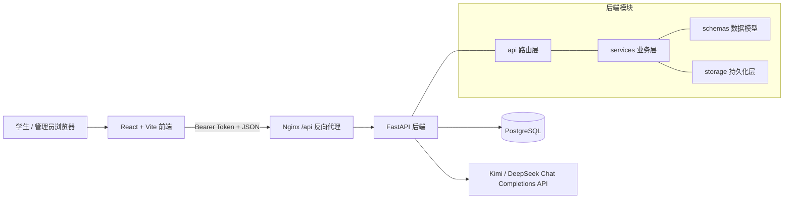
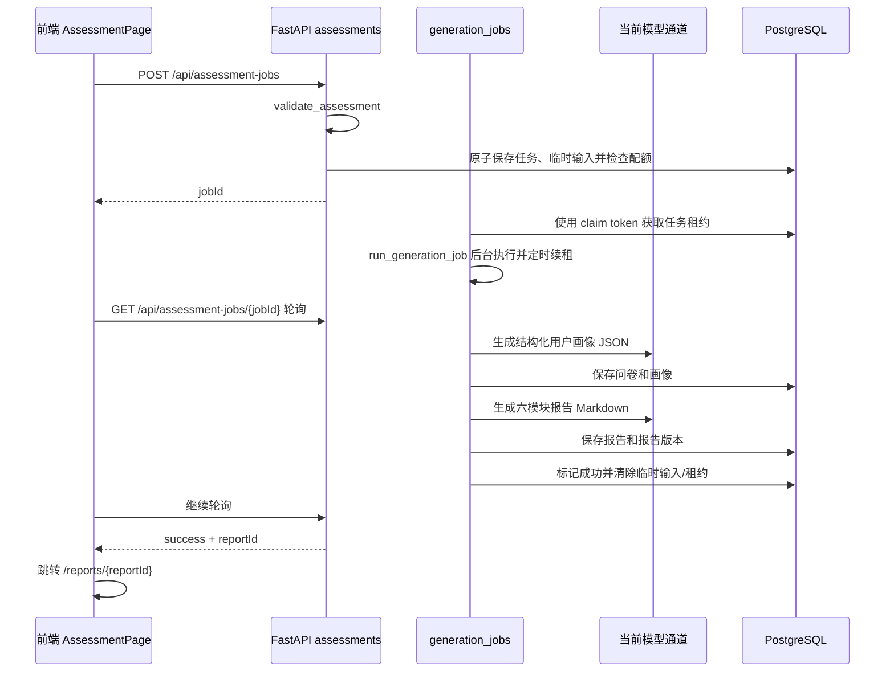
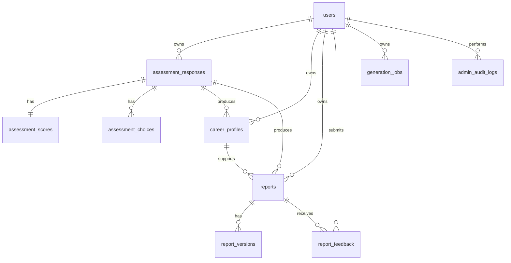

# 大学生生涯规划智能小助手系统实现文档

## 1. 系统概述

大学生生涯规划智能小助手是一个面向学生的生涯规划问卷与 AI 报告生成系统。系统采用前后端分离架构：

- 前端：React 19 + TypeScript + Vite，负责学生问卷、报告查看、反馈提交、隐私数据管理和管理员后台，并提供手机端响应式布局。
- 后端：FastAPI + Pydantic + PostgreSQL，负责账号认证、问卷校验、可恢复报告生成任务、数据持久化、删除和管理审计接口。
- 数据库：PostgreSQL 16，核心关系字段单独建列，复杂业务对象以 JSONB 保存。
- 大模型：Kimi / DeepSeek Chat Completions API，由后端环境变量选择通道，采用“结构化画像生成 -> 六模块报告生成”的两阶段流程。
- 部署：Docker Compose 编排 PostgreSQL、后端 FastAPI 和前端 Nginx。

系统的主要使用角色有两类：

- 学生：注册/登录、填写问卷、等待报告生成、查看或删除历史报告、提交报告反馈、清除自己的业务数据。
- 管理员：查看全站指标和学生生成记录、查看问卷与报告、人工编辑报告标题和正文、查询管理员审计日志。

当前账号认证仅用于本地开发和联调。真实 jAccount 接入及学校侧登录流程不属于本轮实现范围，由学校统一处理。语音输入已接入统一后端转写接口，页脚主管单位/联系方式仍待学校提供。

## 2. 技术栈

| 层级 | 技术 | 说明 |
| --- | --- | --- |
| 前端框架 | React 19、React Router | 单页应用，按路由区分学生和管理员页面 |
| 前端构建 | Vite、TypeScript | `npm run dev` 本地开发，`npm run build` 生产构建 |
| 后端框架 | FastAPI | REST API、鉴权依赖、CORS、健康检查 |
| 数据校验 | Pydantic v2 | 请求、画像、报告、任务状态等 schema |
| 数据库 | PostgreSQL + psycopg 3 | 表结构由后端启动时自动创建 |
| AI 调用 | httpx + Kimi / DeepSeek API | 后端统一分发，画像阶段启用 JSON mode |
| 生产服务 | Docker Compose、Nginx | Nginx 托管前端静态资源并反向代理 `/api` |

## 3. 代码结构

```text
Siyuan-Compass/
  .env.example                  # 唯一环境变量模板
  README.md
  docker-compose.yml
  docker-compose.dev.yml
  siyuan-compass-images-latest-amd64.tar.gz  # 当前离线镜像包
  backend/
    Dockerfile
    requirements.txt
    app/
      main.py                    # FastAPI 应用入口与启动清理
      core/config.py             # 环境变量配置
      api/                       # HTTP 路由层
      schemas/                   # Pydantic 数据模型
      services/                  # 业务服务、AI 编排、校验逻辑
      llm/provider.py            # Kimi / DeepSeek 通道选择与统一分发
      llm/kimi.py                # Kimi API 客户端
      llm/deepseek.py            # DeepSeek API 客户端
      storage/json_db.py         # PostgreSQL 持久化层
    tests/                       # 质量、任务恢复和数据最小化单元测试
  frontend/
    Dockerfile
    nginx.conf
    package.json
    src/
      app/App.tsx                # 前端路由与导航
      auth/                      # 登录状态、未授权处理与路由保护
      api/                       # API client
      pages/                     # 页面组件
      components/                # 表单控件、报告渲染器、页脚
      features/assessment/       # 问卷选项配置
      types/                     # 前端类型定义
      styles/global.css
      storage/                   # 用户隔离且带过期时间的浏览器草稿
      test/                      # Vitest 测试环境
  docs/
```

注意：`backend/app/storage/json_db.py` 当前文件名保留了历史命名，但实际实现已经是 PostgreSQL 存储，不是本地 JSON 文件数据库。

## 4. 总体架构


```mermaid
flowchart LR
  U["学生 / 管理员浏览器"] --> F["React + Vite 前端"]
  F -->|Bearer Token + JSON| N["Nginx /api 反向代理"]
  N --> B["FastAPI 后端"]
  B --> DB[("PostgreSQL")]
  B --> L["Kimi / DeepSeek Chat Completions API"]

  subgraph Backend["后端模块"]
    A["api 路由层"]
    S["services 业务层"]
    P["schemas 数据模型"]
    R["storage 持久化层"]
  end

  B --- A
  A --- S
  S --- P
  S --- R
```

生产环境下只有前端容器暴露 HTTP 端口。浏览器访问静态页面后，所有 `/api/*` 请求由 Nginx 转发到后端容器。后端不直接暴露到公网。

## 5. 核心业务流程

### 5.1 学生注册与登录

1. 学生访问 `/register` 或 `/login`。
2. 前端调用：
   - `POST /api/auth/register`
   - `POST /api/auth/login`
3. 后端对用户名做 trim + lower 规范化。
4. 密码使用 PBKDF2-SHA256 加盐哈希，迭代次数为 `210000`。
5. 登录成功后后端返回自定义 HMAC token。
6. 前端把 token 和用户信息保存到 `localStorage`：
   - `siyuan_auth_token`
   - `siyuan_auth_user`
7. 后续 API 请求由 `frontend/src/api/client.ts` 自动附带 `Authorization: Bearer <token>`。

鉴权逻辑在 `backend/app/services/auth.py` 中实现：

- `require_user`：校验 Bearer token 并读取用户。
- `require_admin`：在用户校验基础上检查 `role == "admin"`。

### 5.2 学生填写问卷并生成报告

前端页面：`frontend/src/pages/AssessmentPage.tsx`

当前问卷与提交体验包括：

- 提交前在前端做必填项校验，漏填时显示“还有 N 项未完成”。
- 必填题显示 `*`，漏填字段会红框高亮并显示具体错误文案。
- 自动跳转到第一道漏填题所在步骤，并滚动到对应字段。
- 用户点击提交后禁用提交按钮，防止重复提交。
- 生成中展示清晰阶段：问卷已提交、整理问卷、生成画像、校验画像、生成报告、校验报告、完成。
- 生成失败后展示失败阶段和失败原因，并提供“重新生成”和“返回修改问卷”。
- 问卷草稿和报告预填按 `user.id` 使用不同的 `localStorage` key，记录明确的过期时间，最长保存 7 天。
- 登录态切换时不会读取其他用户的草稿；退出会清除当前账号草稿和预填，同时清除旧版本未隔离的存储 key。
- 报告生成成功后清除草稿。
- 组件卸载或用户离开页面时会中止轮询，避免离开页面后继续更新状态。
- 问卷采集姓名、学号和联系方式（均为选填），性别及 5/10 年预期收入为必填；姓名、学号、联系方式和收入预期不会发送给 AI 服务。
- 健康、精力和心理感受相关题目前不再增加额外的敏感信息用途说明，数据处理规则统一见隐私政策。

当前已完成第四阶段“报告结构升级”增强：

- 结构化画像新增 `Plan C`，用于表达系统建议路径。
- 报告生成由 Plan A / Plan B 双路径升级为 Plan A / Plan B / Plan C 三路径。
- 报告第三模块固定回应“你现在最大的困惑是什么”“这个困惑背后的真正问题是什么”“接下来可以如何验证”。
- 新报告字数目标调整为 5000-6000 字符。
- 报告页底部明显展示“请为本报告评分”入口。
- 管理员后台展示平均理解度、平均启发度、平均行动性、平均推荐度和低分报告列表。

后端入口：

- 异步任务接口：`POST /api/assessment-jobs`
- 任务轮询接口：`GET /api/assessment-jobs/{jobId}`
- 保留同步接口：`POST /api/assessments`

创建任务时，后端在同一数据库事务中完成用户级并发检查、每日配额检查以及问卷临时输入保存：

- 默认每名学生每天最多创建 3 次任务，按 `Asia/Shanghai` 自然日计算。
- `0` 表示关闭每日配额；限制和时区可通过环境变量调整。
- 每名学生同一时刻只允许一个 `queued` 或 `running` 任务。
- 临时问卷输入会先移除“不保存”字段，替换其中已知的身份值及明显的邮箱、手机号和长数字标识，再保存在 `generation_jobs.input_data`，且不会由任务查询接口返回。
- 当日配额计数写在登录账号记录中；删除报告、任务或全部业务数据不会重置当日额度。

推荐流程使用异步任务：


```mermaid
sequenceDiagram
  participant F as 前端 AssessmentPage
  participant A as FastAPI assessments
  participant J as generation_jobs
  participant L as 当前模型通道
  participant D as PostgreSQL

  F->>A: POST /api/assessment-jobs
  A->>A: validate_assessment
  A->>D: 原子保存任务、临时输入并检查配额
  A-->>F: jobId
  J->>D: 使用 claim token 获取任务租约
  J->>J: run_generation_job 后台执行并定时续租
  F->>A: GET /api/assessment-jobs/{jobId} 轮询
  J->>L: 生成结构化用户画像 JSON
  J->>D: 保存问卷和画像
  J->>L: 生成六模块报告 Markdown
  J->>D: 保存报告和报告版本
  J->>D: 标记成功并清除临时输入/租约
  F->>A: 继续轮询
  A-->>F: success + reportId
  F->>F: 跳转 /reports/{reportId}
```

任务状态由 `GenerationJobStatus` 描述，关键字段包括：

- `status`：`queued`、`running`、`success`、`failed`、`cancelled`
- `stage`：当前阶段，例如 `profile_generating`、`report_validating`、`completed`
- `progress`：0 到 100 的前端进度条数值
- `message`：给学生展示的阶段文案
- `responseId`、`profileId`、`reportId`：生成成功后关联业务对象
- `error`：失败原因
- `attempts`：任务被 worker 领取执行的次数

任务恢复机制：

- 后端启动时扫描 PostgreSQL 中的 `queued` 和 `running` 任务并重新调度；`running` 任务只有在原租约到期后才能被新 worker 领取。
- worker 使用 claim token、租约到期时间和心跳续租，避免多个实例同时推进同一任务。
- 取消和进度更新使用带状态/claim 条件的更新，防止旧 worker 在取消后把任务覆盖为成功。
- 如果报告事务已提交但最终任务状态尚未写回，恢复时复用已保存结果，不重复生成报告版本。
- 任务成功、失败或取消后清除临时输入；终态任务记录默认保存 30 天。

当前前端最多轮询 600 次，每次间隔 1 秒；超过约 10 分钟会提示超时。

### 5.3 两阶段 AI 生成流程

报告生成不是直接把问卷发给模型生成最终报告，而是两阶段：

1. 画像生成：`backend/app/services/profile_analyzer.py`
2. 报告生成：`backend/app/services/report_generator.py`

画像阶段：

- 构造 prompt：`backend/app/services/profile_prompt.py`
- 调用当前后端选中的模型通道，开启 JSON mode。
- 解析模型返回 JSON。
- 用 `ProfileAnalysisResult` 校验字段。
- 至少需要包含摘要、动机、优势、风险、路径判断、Plan A / Plan B / Plan C 等任一核心内容。
- 如果 JSON 解析或字段校验失败，会自动重试 1 次，并把失败原因传给模型用于修正。
- 画像可用但辅助字段缺失时，不中断流程，而是写入 `qualityWarnings`。

报告阶段：

- 构造 prompt：`backend/app/services/report_prompt.py`
- 基于原始问卷和结构化画像生成六模块 Markdown 报告。
- 用 `report_quality_check.py` 检查六个模块及其最低内容量、Plan A / Plan B / Plan C 的实质差异、每条路径的验证行动或切换条件、第四模块 3—5 个行动项、最大困惑回应、截断状态和直接身份信息泄露等要求。
- 第一次质量检查为 `failed` 时，把具体失败项连同上一版内容发回模型，自动完整修复一次。
- 自动修复后仍为 `failed` 时接口返回错误，不保存备用模板报告。
- 如果质量为 `passed` 或 `warning`，保存报告，同时写入报告版本。

两阶段模型请求共用数据最小化规则：姓名、学号、联系方式、学校、收入预期、内部 ID、时间戳以及不需要分析的字段从结构中移除；已知身份值及明显的邮箱、手机号和长数字标识如果出现在自由文本中还会再做文本替换。姓名、地址和社交账号无法完全自动识别，因此仍建议不要在自由文本中重复填写不必要的身份信息。模型原始响应只在当前请求中解析与校验，不写入新的画像记录。

### 5.4 报告查看、历史报告与反馈

学生查看报告：

- 页面：`frontend/src/pages/ReportPage.tsx`
- 接口：`GET /api/reports/{reportId}`
- 权限：学生只能读取自己的报告；管理员可以读取全部报告。

我的报告：

- 页面：`frontend/src/pages/MyReportsPage.tsx`
- 接口：`GET /api/reports/mine`
- 返回当前登录学生的已生成报告和非成功生成任务。
- 页面会展示正在生成、生成失败、已取消和已生成的记录。
- 有正在生成的任务时，页面会自动轮询刷新进度。
- 学生可通过 `POST /api/assessment-jobs/{jobId}/cancel` 取消自己的 `queued` 或 `running` 任务。
- 已生成报告可通过“修改问卷重新生成”把原问卷内容预填回问卷页，修改后提交会生成新的报告记录。
- 学生可删除一份报告；删除时同时清理仅由该报告引用的问卷、画像、版本、反馈和关联任务记录。
- `/privacy` 页面提供“清除我的全部业务数据”，用于清除当前学生的问卷、画像、报告、版本、反馈和生成任务，但保留登录账号。

反馈：

- 页面：`frontend/src/pages/FeedbackPage.tsx`
- 接口：`POST /api/reports/{reportId}/feedback`
- 评分字段：
  - `understandingScore`
  - `insightScore`
  - `actionScore`
  - `recommendScore`
- 每个评分必须是 1 到 5 的整数。

### 5.5 管理员后台与人工编辑

管理员后台页面：`frontend/src/pages/AdminPage.tsx`

接口：

- `GET /api/admin/metrics`：全站统计指标。
- `GET /api/admin/records`：学生报告生成记录。
- `PUT /api/admin/reports/{reportId}`：编辑报告标题和正文。

管理员编辑报告流程：

1. 管理员从后台进入 `/admin/reports/{reportId}/edit`。
2. 前端先通过 `GET /api/reports/{reportId}` 加载报告。
3. 管理员修改标题或 Markdown 正文。
4. 保存时调用 `PUT /api/admin/reports/{reportId}`。
5. 后端重新计算字数、重新做质量检查。
6. 当前报告被覆盖为管理员编辑版。
7. `report_versions` 写入新版本，source 为 `admin_edit`。
8. `admin_audit_logs` 记录管理员操作。

管理员敏感访问审计还覆盖：

- 查看全站学生报告记录；
- 查看一份完整问卷；
- 查看管理员审计日志。

审计只记录管理员、动作、对象、时间和必要的最小变更信息，不复制完整问卷或模型内容。管理员编辑保存前会阻止明显手机号、邮箱或长数字标识进入报告。审计查询接口支持 `limit` 和 `offset`，单次最多返回 200 条；日志保留 180 天。

## 6. 后端实现

### 6.1 应用入口

文件：`backend/app/main.py`

主要职责：

- 创建 FastAPI 应用。
- 注册 CORS 中间件。
- 提供 `/health` 健康检查。
- 启动时执行：
  - `ensure_storage()`：创建数据库表和索引。
  - `ensure_admin_account()`：如果管理员账号不存在，则用环境变量创建管理员。
  - 恢复 PostgreSQL 中未完成或租约已过期的生成任务。
  - 清理超过保存期限的终态任务、管理员审计日志、历史画像原始输出和历史问卷禁止保存字段。
  - 清零已经跨过自然日的账号级生成配额计数。
  - 启动后台维护循环，每 24 小时重复执行上述数据清理。
- 挂载路由：
  - `auth_router`
  - `assessments_router`
  - `reports_router`
  - `feedback_router`
  - `privacy_router`
  - `admin_router`
  - `llm_router`

### 6.2 配置

文件：`backend/app/core/config.py`

配置类：`Settings`

后端配置固定读取项目根目录 `.env`，路径由 `backend/app/core/config.py` 内的 `ROOT_ENV_FILE` 计算得到。这样从 `backend/` 目录本地运行 `uvicorn`、从项目根目录运行测试、或通过 Docker Compose 启动时，都使用同一份环境配置。

主要环境变量：

| 变量 | 用途 |
| --- | --- |
| `LLM_PROVIDER` | 后端模型通道，可选 `kimi` 或 `deepseek`，默认 `kimi` |
| `KIMI_API_KEY` | Kimi API Key，选择 Kimi 时必需 |
| `KIMI_BASE_URL` | Kimi API 地址，默认 `https://api.moonshot.cn/v1` |
| `KIMI_MODEL` | 模型名，默认 `kimi-k2.6` |
| `DEEPSEEK_API_KEY` | DeepSeek API Key，选择 DeepSeek 时必需 |
| `DEEPSEEK_BASE_URL` | DeepSeek API 地址，默认 `https://api.deepseek.com` |
| `DEEPSEEK_MODEL` | 模型名，默认 `deepseek-chat` |
| `LLM_TIMEOUT_SECONDS` | 大模型请求超时时间 |
| `FRONTEND_ORIGINS` | CORS 白名单，支持逗号分隔 |
| `AUTH_SECRET` | HMAC token 签名密钥 |
| `AUTH_TOKEN_HOURS` | token 有效小时数 |
| `REPORT_GENERATION_DAILY_LIMIT` | 每名学生每日可创建的报告生成任务数，默认 `3`，`0` 表示不限制 |
| `REPORT_GENERATION_QUOTA_TIMEZONE` | 每日配额自然日时区，默认 `Asia/Shanghai` |
| `GENERATION_JOB_LEASE_SECONDS` | worker 领取任务后的租约时长，默认 `300` 秒 |
| `GENERATION_JOB_HEARTBEAT_SECONDS` | 运行中任务的续租间隔，默认 `30` 秒 |
| `GENERATION_JOB_RETENTION_DAYS` | 终态生成任务记录保留天数，默认 `30` 天 |
| `ADMIN_AUDIT_RETENTION_DAYS` | 管理员审计日志保留天数，默认 `180` 天 |
| `ADMIN_USERNAME` | 首次启动创建的管理员用户名 |
| `ADMIN_PASSWORD` | 首次启动创建的管理员密码 |
| `ADMIN_DISPLAY_NAME` | 管理员展示名 |
| `POSTGRES_DB` | PostgreSQL 数据库名，主要用于 Compose 生成数据库容器配置 |
| `POSTGRES_USER` | PostgreSQL 用户名，主要用于 Compose 生成数据库容器配置 |
| `POSTGRES_PASSWORD` | PostgreSQL 密码，主要用于 Compose 生成数据库容器配置 |
| `DATABASE_URL` | PostgreSQL 连接串 |
| `VITE_API_BASE_URL` | 本地 Vite 前端请求后端 API 的基础地址 |
| `HTTP_PORT` | Docker 前端容器暴露到宿主机的端口 |

注意：管理员账号只在账号不存在时创建。数据库已有管理员后，仅修改 `.env` 里的 `ADMIN_PASSWORD` 不会自动更新数据库密码。

### 6.3 API 路由

| 文件 | 路由职责 |
| --- | --- |
| `api/auth.py` | 注册、登录、当前用户 |
| `api/assessments.py` | 问卷提交、生成任务创建和轮询 |
| `api/reports.py` | 报告查询、我的报告、报告重新生成 |
| `api/feedback.py` | 报告反馈 |
| `api/privacy.py` | 当前学生全部业务数据清除 |
| `api/admin.py` | 管理指标、生成记录、问卷读取、报告编辑和审计查询 |
| `api/llm.py` | LLM 配置状态检查 |

### 6.4 Schema 模型

主要模型：

- `AssessmentResponseInput`：前端问卷提交数据。
- `AssessmentResponse`：入库后的问卷响应，增加 `id`、`userId`、`submittedAt`、`createdAt`。
- `CareerProfile`：结构化用户画像。
- `CareerBlueprintReport`：最终报告。
- `GenerationJobStatus`：异步生成任务状态。
- `ReportFeedback`：学生反馈。
- `AuthUser`、`AuthResult`：登录返回数据。

### 6.5 问卷校验

文件：`backend/app/services/assessment_validator.py`

校验内容：

- 必填字符串字段不能为空。
- 多选字段至少选择 1 项。
- `topValuesRanked` 必须选择 3 项。
- `missingResources` 最多 3 项。
- `careerConfusions` 最多 3 项。
- 分数字段由 Pydantic 限制在 1 到 5。
- 姓名、学号、联系方式为选填；性别和 5/10 年收入为必填。姓名、学号、联系方式和收入预期会保存在问卷快照中，但不会发送给 AI 服务；旧版停用字段仍由持久化层禁止保存。

校验失败时，接口返回 HTTP 400，错误格式为：

```json
{
  "detail": {
    "errors": ["请填写学院和专业"],
    "fieldErrors": {
      "collegeMajor": "请填写学院和专业"
    }
  }
}
```

其中 `errors` 用于兼容通用错误展示，`fieldErrors` 用于前端把后端校验错误映射到具体问卷字段。

### 6.6 大模型客户端

统一入口：`backend/app/llm/provider.py`

客户端：`backend/app/llm/kimi.py` 和 `backend/app/llm/deepseek.py`

实现要点：

- 使用 `LLM_PROVIDER` 在后端选择 Kimi 或 DeepSeek，前端不参与选择。
- 使用 `httpx.AsyncClient` 发起异步请求。
- 请求地址：`{当前通道_BASE_URL}/chat/completions`
- 请求头使用 Bearer API Key。
- Kimi 使用流式返回并在后端聚合正文，DeepSeek 使用非流式返回。
- 画像阶段可传 `json_mode=True`，会附加：

```json
{
  "response_format": {
    "type": "json_object"
  }
}
```

- 如果 API Key 未配置、HTTP 状态码异常、内容为空，都会抛出错误。

## 7. 数据库设计

数据库表由 `backend/app/storage/json_db.py` 中的 `CREATE_TABLES_SQL` 定义，在后端启动时自动创建。

### 7.1 表清单

| 表 | 说明 |
| --- | --- |
| `users` | 用户账号，包含学生和管理员 |
| `assessment_responses` | 问卷主记录和单值答案快照 |
| `assessment_scores` | 能力分、兴趣分 |
| `assessment_choices` | 多选题答案，按题目和顺序拆行保存 |
| `career_profiles` | 结构化生涯画像 |
| `reports` | 当前报告 |
| `report_versions` | 报告历史版本 |
| `generation_jobs` | AI 生成任务状态、短期输入、claim token 和租约到期时间 |
| `report_feedback` | 学生报告反馈 |
| `admin_audit_logs` | 管理员操作日志 |

### 7.2 关系


```mermaid
erDiagram
  users ||--o{ assessment_responses : owns
  users ||--o{ career_profiles : owns
  users ||--o{ reports : owns
  users ||--o{ report_feedback : submits
  users ||--o{ generation_jobs : owns
  users ||--o{ admin_audit_logs : performs
  assessment_responses ||--|| assessment_scores : has
  assessment_responses ||--o{ assessment_choices : has
  assessment_responses ||--o{ career_profiles : produces
  assessment_responses ||--o{ reports : produces
  career_profiles ||--o{ reports : supports
  reports ||--o{ report_versions : has
  reports ||--o{ report_feedback : receives
```

### 7.3 存储策略

系统采用“关系字段 + JSONB 快照”的混合存储：

- 需要关联、排序、筛选的字段单独建列，例如 `user_id`、`response_id`、`profile_id`、`created_at`。
- 问卷、画像、报告完整对象保存到 `data JSONB`，便于前端直接读取完整结构。
- 多选题拆到 `assessment_choices`，避免复杂数组字段影响后续统计分析。
- 能力分和兴趣分拆到 `assessment_scores`，便于后续做聚合分析。
- 报告每次生成、重生成或管理员编辑都会写入 `report_versions`。
- `assessment_responses.data` 保存本轮允许采集的身份、性别和收入预期字段；不保存 `ASSESSMENT_NON_PERSISTED_FIELDS` 中列出的停用字段。
- `career_profiles.data` 不保存 `rawModelOutput`；启动清理会从历史 JSONB 记录中移除已有原始输出。
- `generation_jobs.input_data` 与公开的任务状态 JSONB 分列保存；输入先剔除禁止保存字段，轮询接口也不会返回问卷临时输入。
- `users.generation_quota_day` 和 `users.generation_quota_used` 保存当日最小配额计数，避免用户通过删除报告或任务重置额度。
- `claim_token` 与 `lease_expires_at` 用于任务恢复和多 worker 排他领取；按 `generation_job_id` 建立的报告版本唯一索引避免恢复时重复写版本。

数据删除均在 PostgreSQL 事务中完成：单份报告删除会清理关联且不再被其他报告引用的问卷/画像；全部业务数据删除会利用外键级联清理当前学生的问卷、画像、报告、版本和反馈，并显式删除生成任务。登录账号保留。

## 8. 前端实现

### 8.1 应用入口与路由

文件：`frontend/src/app/App.tsx`

主要路由：

| 路径 | 页面 | 权限 |
| --- | --- | --- |
| `/` | 首页 | 公开 |
| `/login` | 登录 | 公开 |
| `/register` | 注册 | 公开 |
| `/privacy` | 隐私政策与数据管理 | 公开；学生登录后可执行数据清除 |
| `/assessment` | 问卷填写 | 学生 |
| `/my-reports` | 我的报告 | 学生 |
| `/reports/:reportId` | 报告详情 | 登录用户 |
| `/reports/:reportId/feedback` | 报告反馈 | 学生 |
| `/admin` | 管理员后台 | 管理员 |
| `/admin/assessments/:responseId` | 完整问卷详情 | 管理员 |
| `/admin/reports/:reportId/edit` | 编辑报告 | 管理员 |
| `*` | 404 页面 | 公开 |

路由保护由 `frontend/src/auth/ProtectedRoute.tsx` 实现：

- 未登录用户跳转 `/login`。
- 角色不匹配时，管理员跳转 `/admin`，学生跳转 `/assessment`。

### 8.2 登录状态

文件：`frontend/src/auth/AuthContext.tsx`

实现要点：

- 通过 React Context 保存当前用户。
- token 和 user 存在 `localStorage`。
- `completeLogin` 写入本地存储并更新状态。
- `logout` 清除 token、用户信息、当前用户的问卷草稿和报告预填，并清除旧版本未按用户隔离的草稿 key。
- `getAuthToken` 供 API client 读取 token。
- API 返回 401 时按强制退出处理：清理失效认证信息、当前账号草稿与预填，并通知 Context 更新状态。

### 8.3 API Client

文件：`frontend/src/api/client.ts`

职责：

- 拼接 `VITE_API_BASE_URL`。
- 默认发送 `Content-Type: application/json`。
- 自动附带 Bearer token。
- 统一解析 JSON、纯文本和空响应；网关返回 HTML 错误页时展示明确的 HTTP 错误，不把 JSON 解析异常暴露给用户。
- 网络断开时提供统一提示，并允许调用方通过 `AbortSignal` 取消请求。
- 带 token 的请求返回 401 时清理本地认证信息。
- 后端返回 `detail.fieldErrors` 时，会把字段级错误挂到抛出的 `Error.fieldErrors` 上，供问卷页定位具体字段。

默认本地 API 地址为：

```text
http://localhost:8000/api
```

`frontend/vite.config.ts` 设置了 `envDir: "../"`，因此本地 `npm run dev` 会读取项目根目录 `.env`。生产构建时 Dockerfile 将 `VITE_API_BASE_URL` 设为 `/api`，浏览器请求会交给 Nginx 反向代理。

### 8.4 问卷页面

文件：`frontend/src/pages/AssessmentPage.tsx`

问卷分 7 个步骤：

1. 基本信息
2. 教育路径
3. 未来愿景
4. 价值能力兴趣
5. 学业与经历
6. 行动与承压
7. 核心困惑

页面包含本地字段级校验、用户隔离的 7 天草稿保存/恢复、防重复提交、可取消的生成进度轮询、失败重试和返回修改问卷。提交后页面进入生成进度状态，根据任务轮询结果更新进度条和阶段文案。生成成功后清除当前用户草稿并跳转到报告详情页。

### 8.5 报告渲染

文件：`frontend/src/components/ReportRenderer.tsx`

后端保存的是 Markdown 风格的报告正文。前端没有引入通用 Markdown 渲染库，而是实现了一个定制解析器：

- 识别一级标题、二级标题、中文章节标题。
- 去除常见 Markdown 标记。
- 将列表和“接下来 6 个月”行动项渲染为专门的 UI 块。
- 对加粗引导词和中文标签做强调展示。

这使报告展示更贴近产品设计，但也意味着报告 prompt 的章节结构变化会影响前端渲染效果。

### 8.6 管理后台

后台页面读取指标和记录：

- `fetchAdminMetrics()`
- `fetchAdminRecords()`

管理员编辑页通过：

- `fetchReport(reportId)` 加载报告。
- `updateAdminReport(reportId, title, content)` 保存修改。

保存后当前报告会被覆盖，学生再次打开报告时看到管理员修改后的版本。

### 8.7 手机端、隐私页和错误页

`frontend/src/styles/global.css` 在 `820px` 和 `480px` 两个宽度区间进行响应式调整：

- 顶部区域允许换行，导航可横向滚动；手机端隐藏退出按钮，桌面端保留。
- 问卷和首页双栏改为单栏，步骤导航改为横向滚动，表单底部操作区使用安全区域内边距并保持可触达。
- 输入框和选项的最小触控高度为 44—48px；管理员记录、报告历史、指标和反馈区域改为单列或可换行布局。
- 报告页、操作按钮、隐私数据清除和页脚在小屏下使用全宽或纵向布局。

### 8.8 语音输入

- 问卷中适合长文本回答的字段提供“语音输入”按钮，录音最长 60 秒，转写文本会追加到当前回答末尾。
- 前端使用浏览器 `getUserMedia` 和 `MediaRecorder`，只在 HTTPS 或 localhost 环境可用；用户必须主动授权麦克风。
- 后端统一提供 `GET /api/speech/status` 与 `POST /api/speech/transcribe`，接口使用 multipart 音频上传、登录态校验、文件大小校验和按账号每日配额。
- 音频不写入 PostgreSQL 或本地文件；后端只在请求内存中读取音频，转写完成后释放。供应商由 `SPEECH_PROVIDER` 选择，默认 `disabled`，当前适配器为 `xfyun_file`。
- `xfyun_file` 对接讯飞“录音文件转写大模型”：后端使用 `SPEECH_XFYUN_APP_ID`、`SPEECH_XFYUN_API_KEY`、`SPEECH_XFYUN_API_SECRET` 签名调用 `/v2/upload` 和 `/v2/getResult`，录音结束后等待完整结果再返回前端。
- 讯飞接口的 `autodialect` 语言模式适合中文/英文和方言；`autominor` 需要单独开通。`SPEECH_XFYUN_DOMAIN=edu` 用于教育场景优化。

应用外层统一渲染页脚，当前仅展示产品名称和 `/privacy` 入口；主管单位、联系方式和正式版权信息待学校提供后补充。通配路由 `*` 渲染 `NotFoundPage`，避免未知地址只显示空白内容。

## 9. API 一览

### 9.1 认证

| 方法 | 路径 | 说明 |
| --- | --- | --- |
| `POST` | `/api/auth/register` | 学生注册 |
| `POST` | `/api/auth/login` | 登录 |
| `GET` | `/api/auth/me` | 当前用户 |

### 9.2 问卷与生成任务

| 方法 | 路径 | 说明 |
| --- | --- | --- |
| `POST` | `/api/assessment-jobs` | 创建异步报告生成任务 |
| `GET` | `/api/assessment-jobs/{jobId}` | 查询任务状态 |
| `POST` | `/api/assessment-jobs/{jobId}/cancel` | 取消当前学生的排队中或运行中任务 |
| `POST` | `/api/assessments` | 同步提交问卷并生成报告，主要用于接口测试 |

### 9.3 报告

| 方法 | 路径 | 说明 |
| --- | --- | --- |
| `GET` | `/api/reports?reportId=...` | 按 query 查询报告，兼容旧调用 |
| `GET` | `/api/reports/mine` | 当前学生的报告列表 |
| `GET` | `/api/reports/{reportId}` | 报告详情 |
| `DELETE` | `/api/reports/{reportId}` | 报告所有者删除关联数据；管理员删除时额外记录审计 |
| `POST` | `/api/reports/regenerate?reportId=...` | 已停用，返回 410；引导使用“修改问卷重新生成” |
| `POST` | `/api/reports/{reportId}/regenerate` | 已停用，返回 410；避免绕过持久任务与每日配额 |

### 9.4 隐私与数据管理

| 方法 | 路径 | 说明 |
| --- | --- | --- |
| `DELETE` | `/api/privacy/my-data` | 清除当前学生全部业务数据，保留登录账号 |

### 9.5 语音转写

| 方法 | 路径 | 说明 |
| --- | --- | --- |
| `GET` | `/api/speech/status` | 当前语音转写通道状态（需登录） |
| `POST` | `/api/speech/transcribe` | 上传一次浏览器录音并返回转写文本（需登录） |

### 9.6 反馈

| 方法 | 路径 | 说明 |
| --- | --- | --- |
| `POST` | `/api/reports/feedback?reportId=...` | 按 query 提交反馈，兼容旧调用 |
| `POST` | `/api/reports/{reportId}/feedback` | 按 path 提交反馈 |

### 9.7 管理员

| 方法 | 路径 | 说明 |
| --- | --- | --- |
| `GET` | `/api/admin/metrics` | 管理指标 |
| `GET` | `/api/admin/records` | 报告生成记录 |
| `GET` | `/api/admin/assessments/{responseId}` | 查看完整问卷并记录审计 |
| `GET` | `/api/admin/audit-logs` | 分页查询管理员审计日志 |
| `PUT` | `/api/admin/reports/{reportId}` | 编辑报告 |

### 9.8 系统状态

| 方法 | 路径 | 说明 |
| --- | --- | --- |
| `GET` | `/health` | 后端健康检查 |
| `GET` | `/api/llm/status` | LLM 配置状态 |

## 10. 本地运行

项目只保留根目录 `.env` 作为唯一环境配置文件。本地后端、本地前端和 Docker Compose 都读取这一份配置：

```bash
cp .env.example .env
```

### 10.1 后端

```bash
cd backend
python -m venv .venv
source .venv/bin/activate
pip install -r requirements.txt
uvicorn app.main:app --reload --port 8000
```

后端需要可访问的 PostgreSQL，并正确配置 `DATABASE_URL`。

### 10.2 前端

```bash
cd frontend
npm install
npm run dev
```

本地访问：

```text
前端：http://localhost:5173
后端：http://localhost:8000
接口文档：http://localhost:8000/docs
```

### 10.3 必需环境变量

生产或真实测试至少需要配置：

```text
LLM_PROVIDER=kimi
KIMI_API_KEY=
DEEPSEEK_API_KEY=
FRONTEND_ORIGINS=
VITE_API_BASE_URL=
AUTH_SECRET=
ADMIN_PASSWORD=
POSTGRES_PASSWORD=
DATABASE_URL=
HTTP_PORT=
```

生成任务相关变量提供默认值，但生产环境仍建议显式记录：

```text
REPORT_GENERATION_DAILY_LIMIT=3
REPORT_GENERATION_QUOTA_TIMEZONE=Asia/Shanghai
GENERATION_JOB_LEASE_SECONDS=300
GENERATION_JOB_HEARTBEAT_SECONDS=30
GENERATION_JOB_RETENTION_DAYS=30
ADMIN_AUDIT_RETENTION_DAYS=180
```

租约时间必须长于心跳间隔。修改配额或租约后需要重启后端容器；生产 `docker-compose.yml` 已显式向后端传入这些变量，开发 Compose 通过根目录 `.env` 读取。

如果缺少当前 `LLM_PROVIDER` 对应的 API Key，画像和报告生成会直接失败，不会生成模板兜底报告。

## 11. Docker 部署与本地开发

项目使用两套职责明确的 Compose 文件：

| 文件 | 用途 | 前端 | 数据 volume |
| --- | --- | --- | --- |
| `docker-compose.yml` | 服务器生产部署 | Nginx，宿主机端口 `${HTTP_PORT:-80}` | `postgres-data` |
| `docker-compose.dev.yml` | 本地开发 | Vite，端口 `5173` | `postgres-dev-data` |

两套配置都启动 PostgreSQL、FastAPI 和前端，且都支持通过 `LLM_PROVIDER` 选择 Kimi 或 DeepSeek。

### 11.1 服务器生产部署

生产环境使用默认 Compose：

```bash
cp .env.example .env
docker compose up -d --build
docker compose ps
docker compose logs -f backend
```

健康检查：

```bash
curl http://localhost/health
```

更新代码：

```bash
git pull
docker compose up -d --build
```

修改 `.env` 后只需重建对应容器，例如：

```bash
docker compose up -d --force-recreate backend
```

### 11.2 本地开发

本地开发版挂载后端和前端源码，代码修改可热更新：

```bash
docker compose -f docker-compose.dev.yml up -d --build
```

访问地址：

```text
前端：http://localhost:5173
后端：http://localhost:8000
```

停止开发模式：

```bash
docker compose -f docker-compose.dev.yml down
```

如果希望彻底清空开发数据库和前端依赖 volume，可以执行：

```bash
docker compose -f docker-compose.dev.yml down -v
```

注意：只在确认本地开发数据无用时才使用 `down -v`。

## 12. 测试与质量保障

后端单元测试覆盖：

- PostgreSQL schema、索引和问卷规范化字段清单。
- 问卷字段调整与密码修改流程。
- 生成任务领取、租约恢复、取消竞争和每日配额。
- 两阶段模型请求的数据最小化，以及原始模型输出不落库。
- 六模块最低内容量、Plan A/B/C 差异、验证行动、3—5 个行动项和身份信息泄露检查。
- 报告质量失败后自动修复一次，以及第二次仍失败的错误路径。
- 用户删除、审计保留和启动清理等隐私生命周期规则。

可运行：

```bash
cd backend
python -m unittest discover -s tests
```

前端使用 Vitest + Testing Library，覆盖：

- 草稿按用户隔离、7 天过期和退出清理。
- API 对非 JSON 错误、网络失败和 401 失效登录的处理。
- 隐私入口、404 页面和手机端退出按钮隐藏标识。
- 隐私页全部业务数据清除交互。

可运行：

```bash
cd frontend
npm test
npm run typecheck
npm run build
```

当前自动化测试主要是单元测试、组件测试和 schema 检查。尚不能替代以下集成验收：

- 鉴权测试：学生不能访问他人报告，非管理员不能访问后台。
- 连接真实 PostgreSQL 的事务、级联删除、租约恢复和并发 worker 测试。
- 使用真实模型供应商的超时、截断和内容质量联调。
- 360px、390px、430px、平板和桌面尺寸的浏览器人工回归。
- 学校登录系统、HTTPS 反向代理和生产部署环境验收。

## 13. 安全与权限

当前已实现的安全机制：

- 密码不明文存储，使用 PBKDF2-SHA256 加盐哈希。
- token 使用 HMAC-SHA256 签名，并带过期时间。
- 业务接口默认依赖登录用户。
- 学生只能读取自己的任务、报告和反馈入口。
- 学生只能删除自己的单份报告或全部业务数据，删除接口不删除登录账号。
- 管理接口使用 `require_admin` 限制。
- 管理员读取敏感记录、问卷、审计日志和编辑报告会留下最小化审计记录。
- 问卷草稿按用户隔离并在 7 天后过期，退出时清理当前用户本地草稿。
- 模型请求排除直接身份和内部元数据，新画像不保存模型原始输出。
- CORS 由 `FRONTEND_ORIGINS` 控制。

上线前必须处理：

- 修改默认 `AUTH_SECRET`。
- 修改默认管理员密码。
- 使用 HTTPS。
- 保护 `.env`，不要提交真实 API Key 和数据库密码。
- 定期备份 PostgreSQL volume。
- 完成模型供应商的数据处理评估，并确认备份介质的延迟删除流程。

## 14. 维护注意事项

1. Prompt 与前端渲染存在结构耦合

   `ReportRenderer` 依赖报告中的中文章节标题、列表和行动项格式。如果修改 `report_prompt.py` 的章节格式，需要同步验证前端报告展示。

2. 画像 schema 是生成质量的第一道边界

   `ProfileAnalysisResult` 决定模型 JSON 输出是否可用。如果新增画像字段，建议同时更新 prompt、schema、质量警告逻辑和报告 prompt。

3. 任务状态持久化，但执行器仍在后端进程内

   `generation_jobs.py` 使用 `asyncio.create_task` 执行任务，同时把输入、状态、claim token 和租约保存在 PostgreSQL。进程重启后能够重新领取未完成任务，但当前没有独立 worker 服务。若未来并发量明显上升，仍建议迁移到 Celery、RQ、Dramatiq 或专用任务队列，并保留现有幂等和租约约束。

4. 数据库 schema 目前由应用启动时创建

   当前没有 Alembic 迁移。新增表字段时需要谨慎处理已有数据，建议引入正式迁移工具。

5. 报告失败不会生成兜底模板

   这是当前设计选择。报告首次质量失败会自动修复一次；选中通道未配置、超时或第二次仍不合格会让任务失败，并把适合用户展示的错误返回前端。

6. `json_db.py` 命名容易误导

   文件实际是 PostgreSQL 存储层。后续可以重命名为 `postgres_storage.py`，但需要同步所有 import。

7. 自动保留清理依赖后端运行

   后端启动时立即清理一次，运行期间每 24 小时继续清理终态任务、管理员审计日志、历史模型原始输出和问卷禁止保存字段。它不是独立的外部调度器，因此后端长期停止时不会执行；如需对停机数据库也严格按日维护，应由部署平台增加外部定时任务。

## 15. 常见扩展点

### 15.1 新增问卷题目

需要同步修改：

- 前端类型：`frontend/src/types/assessment.ts`
- 前端页面：`frontend/src/pages/AssessmentPage.tsx`
- 选项配置：`frontend/src/features/assessment/options.ts`
- 后端 schema：`backend/app/schemas/assessment.py`
- 后端校验：`backend/app/services/assessment_validator.py`
- 画像 prompt：`backend/app/services/profile_prompt.py`
- 存储层：如果是多选字段，需要加入 `ASSESSMENT_LIST_FIELDS`

### 15.2 修改报告结构

需要同步修改：

- `backend/app/services/report_prompt.py`
- `backend/app/services/report_quality_check.py`
- `frontend/src/components/ReportRenderer.tsx`
- 可能还需要调整 `ProfileAnalysisResult.reportEvidenceMap` 的章节映射。

### 15.3 增加管理员能力

建议复用：

- 后端 `require_admin`
- `admin_audit_logs`
- 前端 `/admin` 路由和 `api/admin.ts`

例如新增“删除报告”“导出反馈”“查看报告版本历史”，都应写入审计日志。

## 16. 当前实现边界

- 系统没有接入真实 jAccount；当前登录仅用于本地开发和联调，学校侧认证接入不属于本轮。
- 系统没有邮件、短信或找回密码流程。
- 语音转写供应商默认关闭；启用讯飞时必须配置 `SPEECH_PROVIDER=xfyun_file` 以及 AppID、APIKey、APISecret，并落实 HTTPS、麦克风权限策略、每日配额和学校侧合规审批。
- 页脚暂未包含主管单位、联系方式和正式版权信息，等待学校提供。
- 系统没有正式数据库迁移工具。
- 异步任务没有外部队列或独立 worker，但状态和输入已持久化到 PostgreSQL，进程重启后可在租约释放后恢复。
- 前端报告渲染是定制 Markdown 子集，不是完整 Markdown 解析。
- 生产部署建议放在 HTTPS 反向代理之后，当前 Compose 只提供 HTTP 服务。
- 单元测试和前端构建不能证明真实 PostgreSQL、真实模型 API、学校认证或生产网络环境已经完成集成验证，上线前仍需专门验收。
